# ISP Monitoring System (Flask)

### Краткое описание проекта:

Данная система построена на веб-фреймворке Flask,архитектура монолитная. 
Так как БД в данном проекте не сильно нагружается запросами, за основу была взята SQLite. 
Система ICMP-мониторинга была реализована в виде daemon-потока 
Другие системы и утилиты были реализованы так же, в виде daemon-потоков

### Цели проекта:

* Упростить для работников (операторов, техников, монтажников, сисадминов) использование ресурсов провайдера
* Централизованно мониторить состояние узлов, серверов
* Превратить не дружелюбные для техников и монтажников CLI интерфейсы в графические интерфесы (JS, HTML, CSS)
* Автоматизация рутинных процессов (например регистрация ONT Gpon терминалов)
* Создание системы поиска по логину из Billing системы, откуда физически клиент работает (порт сетевого коммутатора)
* Центральное хранилище конфигураций, прошивок сетевого оборудования
* Более удобная система helpdesk и дополнитеных заявок в отличии от существующей в провайдере

### Основные библиотеки и фреймворки проекта

or just [jump to the conclusion](#func)

### Database
 

### Static files, ssl, proxy

### Простая схема архитектуры проекта

### Основные представления (views) проекта

* [Главная страница / Dashboard](#dash-bord)
* [Мониторинг / ICMP](#icmp)
* [Поиск по логину / Search Port](#search)
* [Заявки на ремонт / HelpDesk](#helpdesk)
* [Заявки на подключение / ConnectStatements](#stmts)
* [Интерфейс / GPON](#gpon)
* [Хранение конфигов / ConfigStorage](#config)
* [Список клиентов / BillingViewer](#carbon)
* [Админ панель / SimpleAdminPanel](#admin)

<h2 id="dash-bord">Dashboard</h2>

Классическая минималистичная главная страница, с небольшими панельками:

* Навигация (меню)
* Dead Hosts раздел ICMP
* Пользователи онлайн

#### Demo прямиком и прода
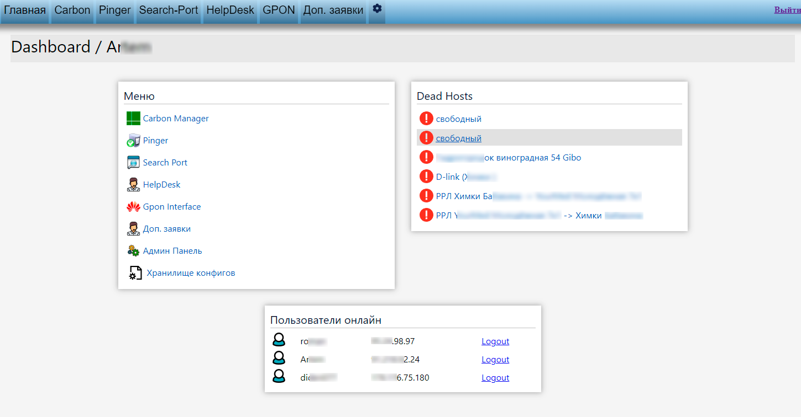

<h2 id="icmp">ICMP</h2>

Один из основных модулей проекта, упрощённо это обычный пингер хостов, который с переодичностью опрашивает хосты по ICMP протоколу. Если какой-либо хост не отвечает, то он помечается как Dead Host и попадает в соответствующую папку. Так же и в обратную сторону, если хост оживает.

#### Основной функционал:

* Проверка хостов с переодичностью (настраивается в admin-панели)
* Создание, редактирование, удаление папок и хостов
* Возможность отключения проверки хоста (пауза)
* Отображение времени изменения состояния хоста (когда упал или поднялся)
* Разграничение прав: user (только чтение) или admin
* Возможность запустить принудительную проверку всех хостов или только Deads

#### ALL Hosts (demo prod)
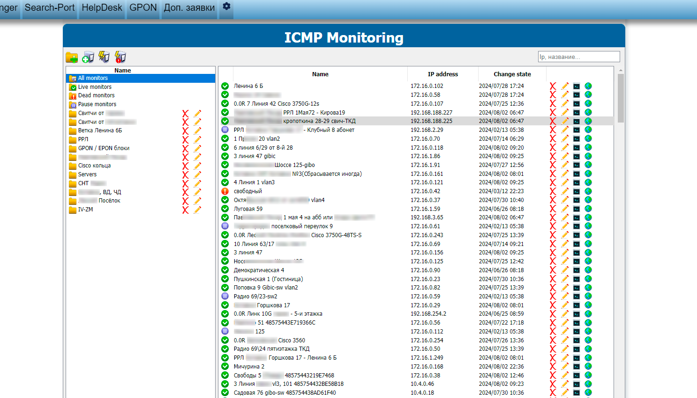

### Редактирование хоста
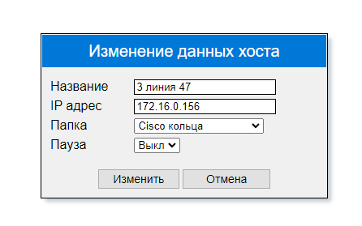

<h2 id="search">Search Port</h2>
Один из основных модулей проекта, выполняет поиск связки сетевого коммутатора и порта откуда физически работает клиент, даже если он уже не в сети, и его MAC адрес не виден.
Модуль довольно сильно адаптирован под определённого провайдера связи, под его стек сетевого оборудования (cisco, d-link, zyxel, huawei)

#### Основной функционал:

* Запись всех связок MAC адресов и портов сетевого оборудования в БД (в виде pickle объектов)
* Запись всех связок MAC адресов и логинов клиентов с PPPoE серверов в БД
* Поиск физического порта клиента по логину
* Поиск физического порта клиента по MAC

#### Краткое описание логики работы:

Сисадмины с некоторой переодичностью (когда считают нужным) снимают dump со всех сетевых устройств. (т.е в БД записиваются порты и MAC адреса на них). Точно такой же процесс происходит и c PPPoE (NAS) серверами. В итоге имеем полноценные dump записи в БД  
Поскольку сеть старая, в ней не фиксировалось откуда работает клиент, ни порт, ни адрес узла связи (switch). Когда наступает момент поломки оборудования (например оптического конвертора), найти от какого узла работает абонент становится тяжёлой задачей (частный сектор), ведь MAC адрес больше не виден.
  
Здесь и помогает данный модуль, достаточно ввести логин абонента, и алгоритм сам найдёт от какого коммутатора работал клиент.

#### Поиск по логину (по MAC аналогично):
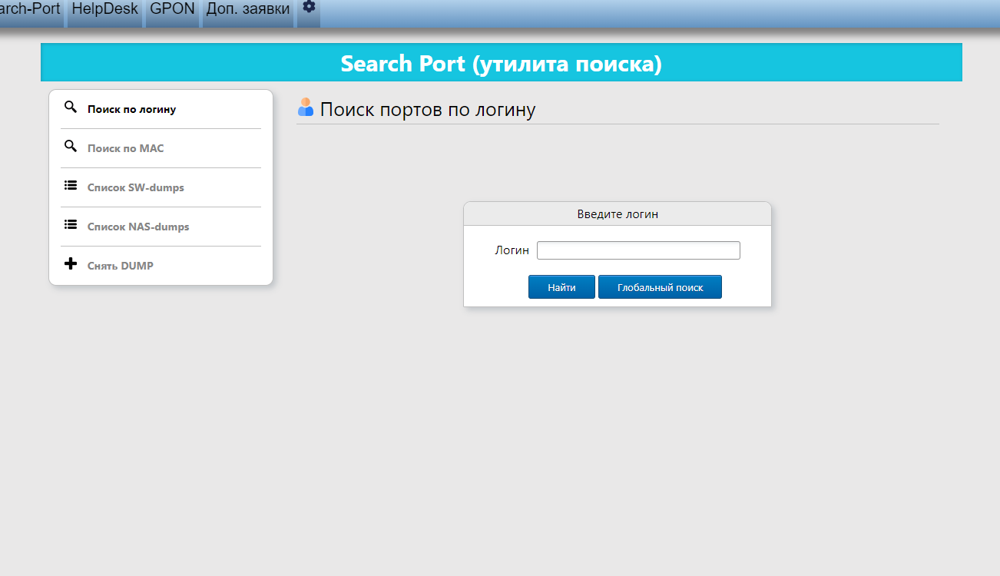

#### Результат поиска:
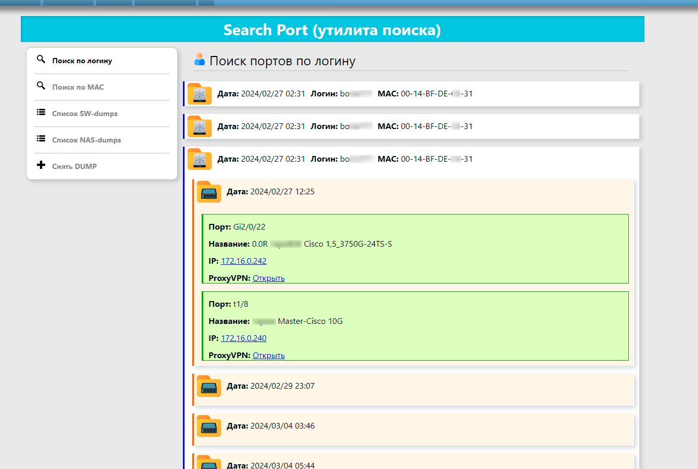

#### Отображение всех записанных dumps:
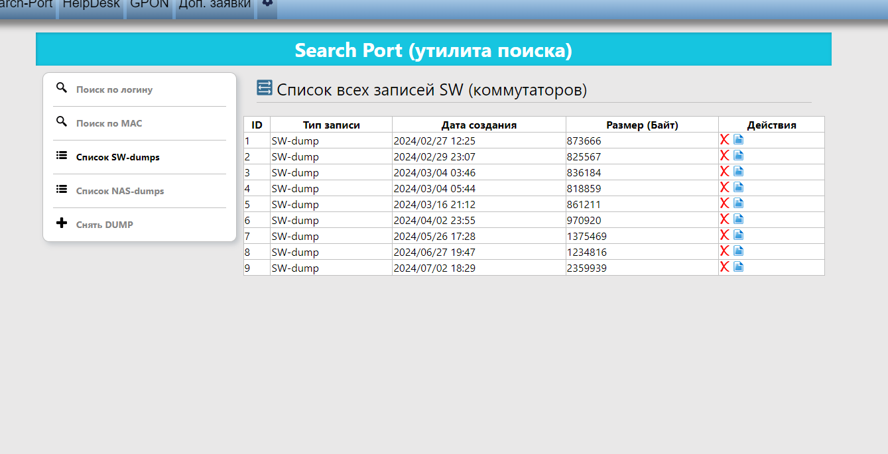

<h2 id="helpdesk">HelpDesk</h2>
Классический HelpDesk, операторы принимают заявки от абонентов и добавляют их сюда  
Данный HelpDesk не работает на основе БД проекта, он построен но базе существующего HelpDesk сервиса (старого), с помощью библиотеки парсинга Bs4 + requests реализован API модуль, который читает (bs4), создаёт, изменяет, закрывает  заявки в старом HelpDesk.  
Основной целью создания этой прослойки, была невозможность изменения старого HelpDesk сервиса, а так как старая версия не удобна, и не имеет адаптации под мобильные устройства, бала написана данная прослойка.

#### Список заявок
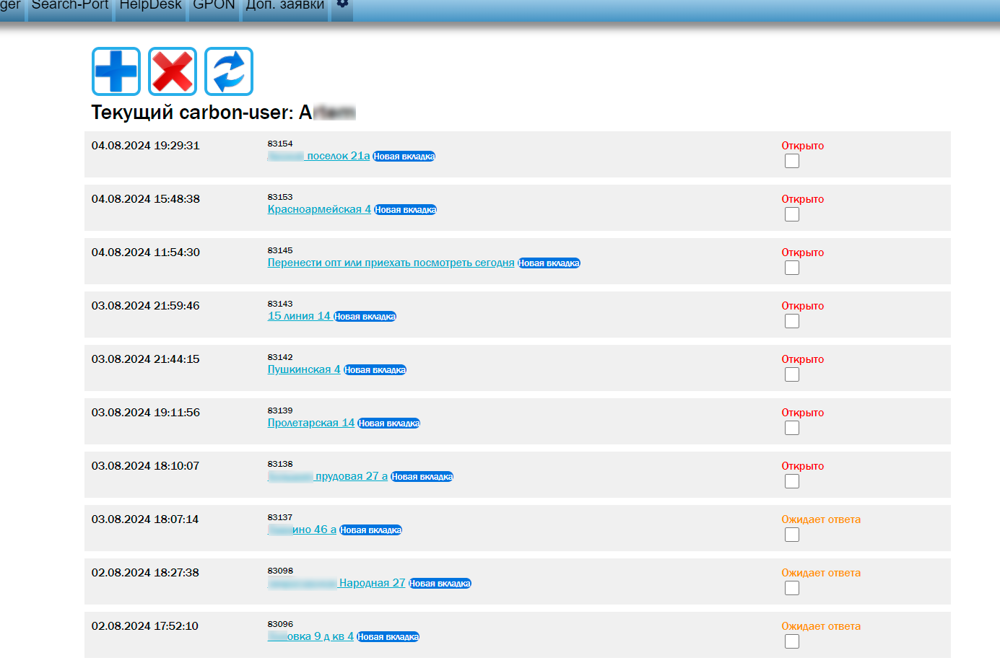

#### Редактирование заявки

<h2 id="stmts">ConnectStatements</h2>
Этот модуль обладает схожей логикой с HelpDesk, но построен уже полностью на основе БД проекта. Заявки редактируются в стиле классического CRUDа  
Сюда оставляются заявки на любые работы кроме ремонтных: подключения, прокладки магистралей, настройки оборудования, доп.работы...

#### Demo из прода
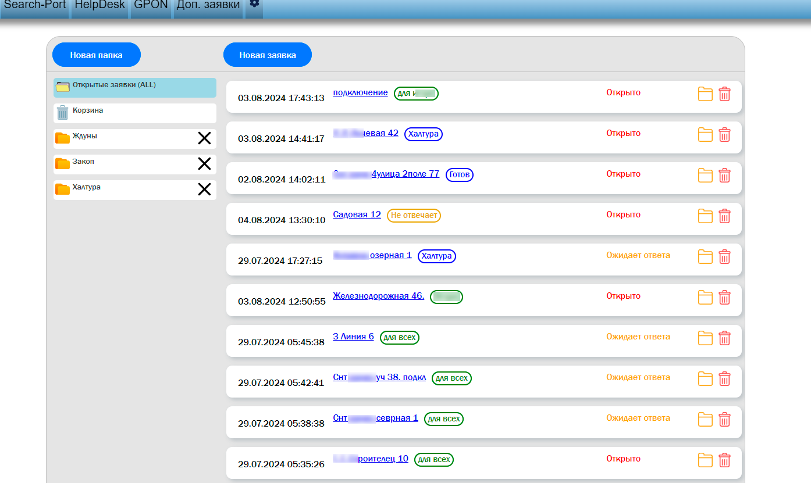

<h2 id="gpon">GPON GUI</h2>

Реализация единого интерфейса, для GPON OLT блоков, которые не имеют встроенного web или desktop интерфейса.

#### Основной функционал:

* Автоматическая регистрация клиентских терминалов (ONT роутеров)
* Ручная регистрация 
* Вывод списков слотов, портов и клиентских ONT терминалов
* Удаление (unregister) ONT терминалов
* Оптический пинг
* Поиск логина PPPoE, если ONT в сети
* Отображение загрузки интерфейсов (Mbit/s)
* Управление service-портами
* Глобальный автоматический поиск по SN (серийному номеру ONT)
* Отображение MAC-table
* Отображение Signals-table
* Сохранение конфигурации на всех слотах, порта и т.д

#### Детали
API для доступа к GPON блокам, написан на основе raw Sockets, с доступом по telnet (внутренней сети провайдера), парсинг значений выполнянется почти без применения re-выражений, так как проще и лаконичнее это было реализовать с помощью (slice, replace, split, strip, find и т.д)

#### Наглядная цель создания этой оболочки (CLI -> GUI)

#### \\/

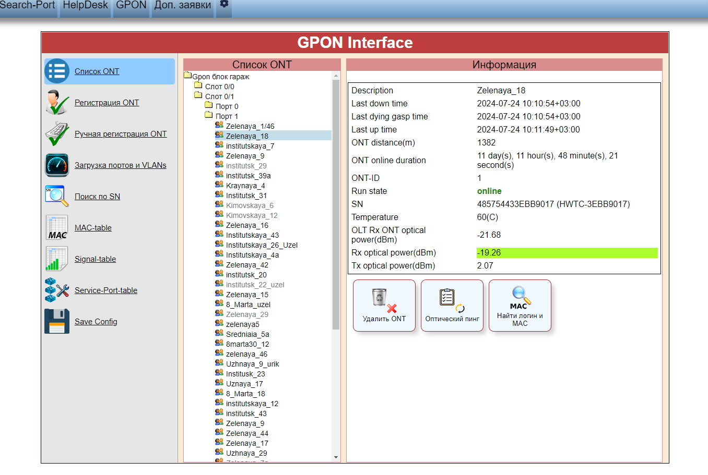

<h2 id="config">Config Storage</h2>
Хранилище конфигов в БД выполнено в CRUD стиле, ничего особенного

<h2 id="carbon">Carbon</h2>
Список всех клиентов в Billing системе, и отображение из состояния (online / offline), API к Billing серверу построен на Bs4 + requests + Nas Poller Daemon (для получение активных PPPoE сессий)

<h2 id="admin">Admin Panel</h2>
Обычная админ панель, для изменения параметров системы в БД

#### Основной функционал:
* Создание, редактирование, удаление новых пользователей
* Настройка ICMP-мониторинга: частота проверок, кол-во icmp пакетов, timeout и т.д
* Настройка GPON-gui: добавление, удаление обслуживаемых Gpon блоков [ip:port:user:password]
* Настройка GPON-профилей регистрации терминалов ONT
* Настройка Carbon-интерфейса [ip:port]
* Логи сервера, модулей, пользователей
* и т.д

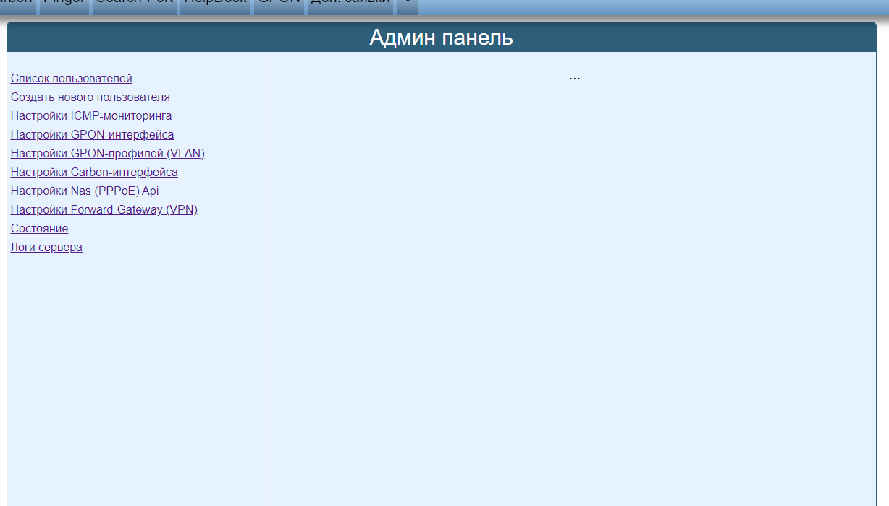
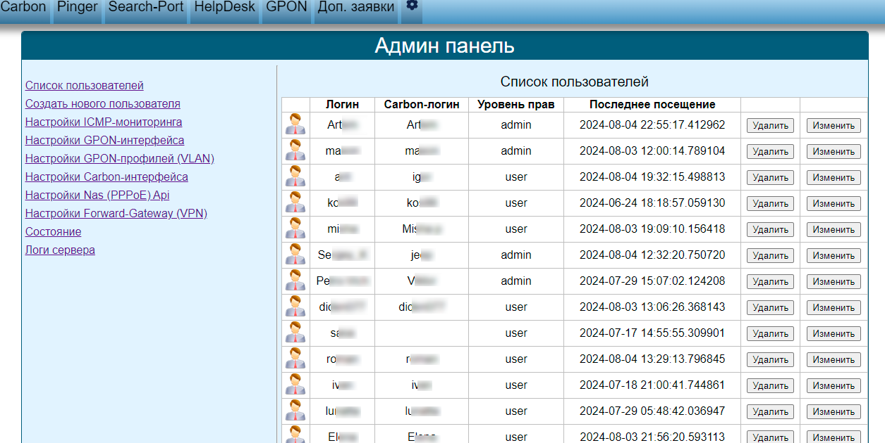

